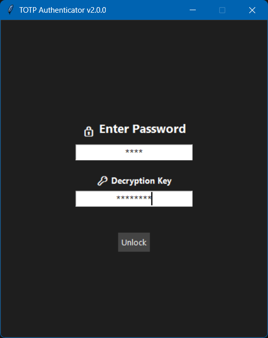

<div align="center">
  <h1><span style="color:#1E90FF">🔐 TOTP Authenticator</span> & <span style="color:#32CD32">QR Tool</span></h1>
  <p><b>All-in-one desktop tools for secure OTP management and QR code magic!</b></p>
</div>

---

## 📖 Overview

**TOTP Authenticator** and **QR Tool** are modern, cross-platform desktop apps for managing your two-factor authentication (2FA) secrets and QR codes securely. With strong encryption, a beautiful UI, and advanced backup options, you stay in control of your credentials—anywhere, anytime.

---

## ✨ Features

### 🔐 TOTP Authenticator
- AES-256 encrypted TOTP manager
- Password lock (stored in OS credentials manager)
- Live OTP list with copy & countdown ⏳
- Crypto utility for quick text encryption/decryption
- GitHub sync for backup/restore
- Password reset & security options

### 📷 QR Tool
- Scan, generate, encrypt, and save QR code data
- TOTP QR generation for authenticator apps
- AES-256 encryption for QR data
- User-friendly, modern interface

---

## � TOTP Authenticator — What It Does

TOTP Authenticator is a secure desktop app for managing all your Time-based One-Time Passwords (TOTPs) in one place, with strong encryption and advanced features for power users.

**Main Features:**
- Secure OTP storage (AES-256 encrypted, only accessible with your key)
- Password lock (stored in OS credentials manager)
- Live OTP list with copy & countdown
- Crypto utility: encrypt/decrypt any text with your login key
- GitHub sync for backup/restore
- Password reset & security options

**Use Cases:**
- Manage all your 2FA/TOTP codes for multiple platforms in one secure app
- Instantly copy OTPs for login, with visual countdown
- Encrypt/decrypt any text (e.g., passwords, notes) using your OTP key
- Back up your secrets to GitHub and restore them on a new device

**How the Decryption Key Works:**
- When you log in, you must enter your decryption key (min 8 chars)
- This key is used to decrypt your OTP secrets and for the crypto utility
- The key is never saved or stored—only you know it!
- Only OTPs encrypted with the key you enter will be shown; others remain hidden and secure

---

## 📷 QR Tool — What It Does

QR Tool is a simple yet powerful desktop app for working with QR codes, especially for two-factor authentication (TOTP) secrets.

**Main Features:**
- Scan & encrypt QR codes (decode, encrypt with your key, save to `encoded.txt`)
- Generate TOTP QR codes for authenticator apps (QR images are saved to your Desktop for easy access)
- Auto-scan and encrypt generated QRs
- Clean, dark-themed UI with toast notifications

**Use Cases:**
- Securely store TOTP secrets from QR codes (e.g., when setting up 2FA)
- Convert a TOTP secret into a QR code for easy scanning
- Encrypt/archive QR code data for backup or cross-device use
- Quickly decode and view any QR code image

---


## 🛠️ Installation & Requirements

- **Windows:**
  - No installation required! Just download the EXE files from [Releases](#-download-ready-to-use-apps-windows) and run them directly.

- **Want to contribute?** See [Contributing](#-contributing).

- **On another OS or want to run from source?** See [Quick Start](#-quick-start).

---

### Requirements for Developers/Other OS

- Python 3.8+
- Install dependencies:
  - `opencv-python`
  - `qrcode`
  - `cryptography`
  - `tkinter` (usually included with Python)
  - `requests` (for TOTP Authenticator)
  - `pyperclip` (for TOTP Authenticator)
  - `keyring` (for TOTP Authenticator)

```bash
pip install -r requirements.txt
```

---

## 🚀 Quick Start

### Windows
1. **Download the latest EXE files** for both apps from the [Releases](https://github.com/ppriyanshu26/AuthPublic/releases) section.
2. **Run the EXE files directly**—no installation or Python required!
  - Start with `QR Tool.exe` to scan/generate and save your encrypted credentials.
  - Then use `TOTP Authenticator.exe` to manage and use your OTPs.

> If you want to contribute or modify the code, clone the repository and follow the developer instructions below.

### Other OS (Linux/macOS)
1. Clone the repo:
   ```bash
   git clone https://github.com/ppriyanshu26/AuthPublic.git
   cd AuthPublic
   ```
2. Install dependencies:
   ```bash
   pip install -r requirements.txt
   ```
3. (Optional) Build a standalone app with PyInstaller:
   ```bash
   pip install pyinstaller
   pyinstaller --onefile --windowed "Python/QR Tool.py"
   pyinstaller --onefile --windowed "Python/TOTP.py"
   ```
   - The executables will be in the `dist/` folder.

---

## 🔒 Security & Data Format

### Password Storage
- Your login password is never stored in plain text
- It is securely hashed and saved using your OS credentials manager (`keyring`):
  - Windows: Credential Manager
  - macOS: Keychain
  - Linux: Secret Service / KWallet / etc.

### Encryption Key: Memorize It!
- The encryption key you enter to encrypt/decrypt your OTP data is never saved anywhere—not in files, not in memory, not in the cloud
- If you forget your encryption key, your encrypted OTP data cannot be recovered!
- Choose a strong but memorable key, and keep it safe

### How Your OTPs Are Stored
- All credentials are stored in a file named `encoded.txt` (in your app data folder).
- **Each line** in this file follows the format:
  ```
  PlatformName, EncryptedTOTPURL
  ```
- The `EncryptedTOTPURL` is an AES-256 encrypted string of a standard TOTP URL, for example:
  ```
  otpauth://totp/Issuer:Email?secret=SECRET&issuer=Issuer&algorithm=SHA1&digits=6&period=30
  ```
- **Multiple credentials** can be stored, each encrypted with any key you choose. 
- **Only the credentials that match the decryption key you enter at login will be shown**—others remain hidden and secure. This means you can use different keys for different sets of credentials, and only those you unlock with your key will be visible.

---

## ☁️ Remote Backup & Access Anywhere

To safeguard your credentials and access them from anywhere:
1. **Upload your `encoded.txt` to a private GitHub repository** (recommended for backup and portability).
2. **Use a fine-grained GitHub access token** (with read access to your private repo) to allow the app to fetch your file securely from anywhere.

**Steps to Set Up Remote Access:**
1. Create a private repository on GitHub (e.g., `totp-backup`).
2. Upload your `encoded.txt` file to this repo.
3. Go to GitHub > Settings > Developer settings > Personal access tokens > Fine-grained tokens.
4. Generate a new token with **read-only** access to your private repo.
5. In the app, use the GitHub file URL (e.g., `https://github.com/yourname/totp-backup/blob/main/encoded.txt`) and your token to sync or restore your credentials from anywhere.

<span style="color:#228B22">✅ This way, your secrets are always encrypted, portable, and only accessible with your key!</span>

---

## 🎥 Project Walkthrough Video

Watch a full walkthrough of the project here:<br>
<a href="https://drive.google.com/file/d/1ebZfiX-PvqSI_XzsmAcSP-zig7Pa5hsd/view?usp=sharing" target="_blank"><b>▶️ Google Drive Video Walkthrough</b></a>

---

## 🤝 Contributing

Contributions, bug reports, and suggestions are welcome! Please open an issue or pull request on [GitHub](https://github.com/ppriyanshu26/AuthPublic).

---


## 🖼️ Screenshots


### TOTP Authenticator Screenshots

<div align="center">
  
  <br><span style="font-size:1.15em;"><b>Login Page</b> — Enter your login password and decryption key to unlock your OTPs</span>
  <br><br><br>
</div>

<div align="center">
  
  <br><span style="font-size:1.15em;"><b>GitHub Sync</b> — Enter your uploaded <code>encoded.txt</code> file URL and GitHub access token for backup/restore</span>
  <br><br><br>
</div>

<div align="center">
  
  <br><span style="font-size:1.15em;"><b>Main UI</b> — View, generate, and copy OTPs for all your accounts</span>
  <br><br><br>
</div>

<div align="center">
  
  <br><span style="font-size:1.15em;"><b>Password Reset</b> — Reset your login password securely if you forget it</span>
  <br><br><br>
</div>

<div align="center">
  
  <br><span style="font-size:1.15em;"><b>Reset Token</b> — Reset your url and access token for the <code>encoded.txt</code> file</span>
  <br><br><br>
</div>

<div align="center">
  
  <br><span style="font-size:1.15em;"><b>Crypto Utility</b> — Encrypt or decrypt any text using your decryption key (stored only for the session)</span>
  <br><br><br>
</div>

---

### QR Tool Screenshots

<div align="center">
  
  <br><span style="font-size:1.15em;"><b>Landing page</b> — Choose between <i>Scan & Encrypt QR Code</i> or <i>Generate QR From Scratch</i></span>
  <br><br><br>
</div>

<div align="center">
  
  <br><span style="font-size:1.15em;"><b>Generate QR From Scratch</b> — Generates a new QR code from user input</span>
  <br><br><br>
</div>

<div align="center">
  
  <br><span style="font-size:1.15em;"><b>Scan & Encrypt QR Code</b> — Decodes the QR, encrypts the data, and saves to <code>encoded.txt</code></span>
  <br><br><br>
</div>

---

## ❓ FAQ

**Q: What if I forget my decryption key?**  
A: There is no way to recover your encrypted OTP data without the key. Always memorize or securely store your key.

**Q: Can I use the same encoded.txt on multiple devices?**  
A: Yes! Just copy or sync your `encoded.txt` and use your decryption key on any device.

**Q: Is my password or key ever sent to the cloud?**  
A: No. Your password is stored only in your OS credentials manager, and your key is never saved anywhere.

**Q: Can I use this for non-TOTP QR codes?**  
A: Yes, QR Tool can scan and encrypt any QR code data, not just TOTP.

**Q: How do I reset my password?**  
A: Use the password reset option in the TOTP Authenticator app footer.

---

## 📦 Download Ready-to-Use Apps (Windows)

Head to the [Releases](https://github.com/ppriyanshu26/AuthPublic/releases) page to download the latest Windows executables for both apps!

---

## 📄 License
<span style="color:#FFA500">This project welcomes contributions and learning.</span> However, redistribution, modification, or serving as a standalone or separate product (including rebranding or repackaging) is <b>not permitted without my prior written consent</b>. See [LICENSE](./LICENSE) for details.
